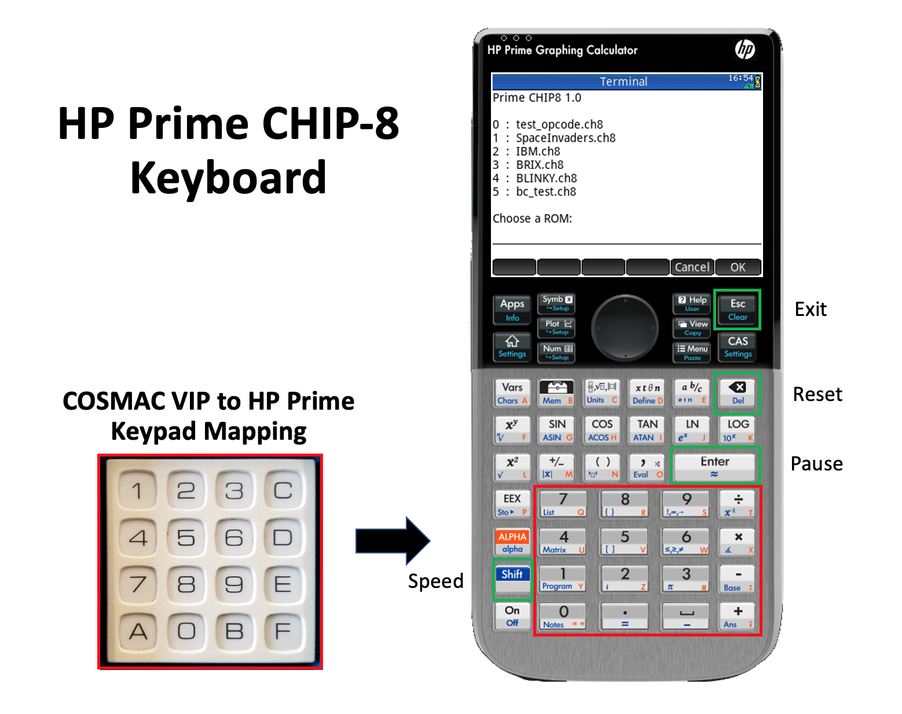

# PrimeCHIP8
CHIP-8 was originally developed in the 1970s by Joseph Weisbecker for creating computer games on early microcomputers. 

This CHIP-8 emulator is for the HP Prime in Python. As the HP Prime does not support sound, CHIP-8 sound operations are ignored.

See a demonstration at: ???
# Installation
Use the HP Connectivity Kit to transfer CHIP8.hpprgm to a virtual or physical HP Prime calculator.

Note: the HP Prime must be running firmware that supports Python (actually MicroPython).
# Keyboard Mapping
The original COSMAC VIP used a 4x4 kex keypad. The mapping of the keypad to the HP Prime keyboard, along with additional keys, is shown below.

# Example ROMs
| Name        | Description        |
|-------------|--------------------|
| test_opcode.ch8 | Simple CHIP-8 opcode test |
| bc_test.ch8 | CHIP-8 opcode test that provides diagnostics if issues are found |
| IBM.ch8     | IBM Logo           |
| Spaceinvaders.ch8 | The classic arcade game, Space Invaders |
| BLINKY.ch8  | The classic arcade game, Pac-Man |
| BRIX.ch8    | Blockout type game |

# Source
CHIP8.py includes the source code and the PPL wrapper for execution on the HP Prime. The source can be loaded into the HP Connectivity Kit, modified if required, and dragged onto a virtual or physical HP Prime calculator.
# References
PrimeCHIP8 is based on: https://github.com/AlpacaMax/Python-CHIP8-Emulator
